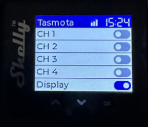

# Shelly Pro 4PM
Basic LVGL UI for Shelly Pro 4PM flashed with Tasmota
<div>

</div>

## Features
- Device and Relay names are configurable in the Configuration / Configure Other menu (Device / Friendly Name 1-5)
- If nothing configured (all are set to "Tasmota" by default) Relays 1-4 will be named "CH 1-4" and Relay 5 will be named "Display"
  
## Installation
ou can download the application file under Releases

To create Tasmota application (.tapp) from the sources checkout the repo end execute:
```
rm -f ShellyPro4PM.tapp; zip -j -0 ShellyPro4PM.tapp src/*
```
