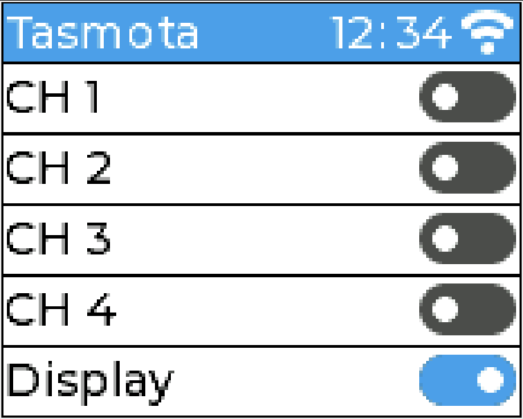

# Shelly Pro 4PM

Basic LVGL UI for Shelly Pro 4PM flashed with Tasmota (using haspmota)

<div>

</div>

## Features

- Device and Relay names are configurable in the Configuration / Configure Other menu (Device / Friendly Name 1-5)
- If nothing configured (all are set to "Tasmota" by default) Relays 1-4 will be named "CH 1-4" and Relay 5 will be named "Display"

## Installation

Use `upload.sh` to create Tasmota extension (.tapp) from the sources and upload to your device:

```
./upload.sh <device-ip> /.extensions
```
